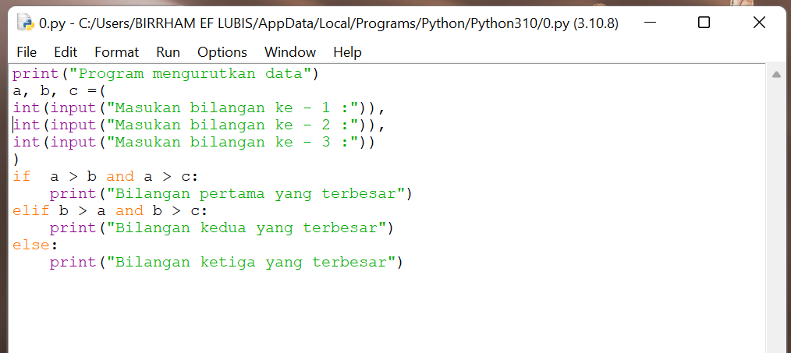
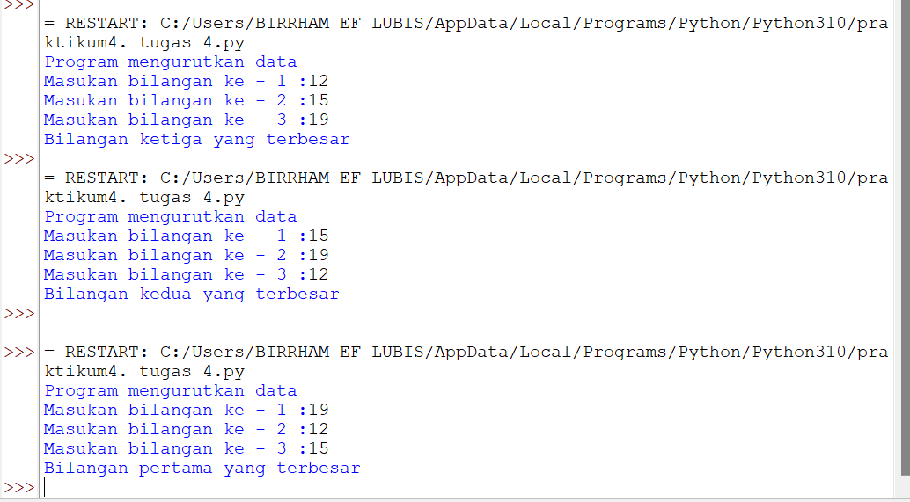

# PRAKTIKUM 4

# Lab 1

## Tugas 1

### - Buat program sederhana mencari bilangan terbesar dari dua buah variabel menggunakan if

Pertama kita harus memasukan inputan, lalu tambah kan a > b:  Lalu lakukan perintah ("print bilangan terbesar = :") 

Selanjutnya tambah kan else untuk menambah kan aksi untuk menentukan mana yang lebih besar antara a dan b

Masukan dua angka yang berbeda dan program akan menentukan angka mana yang lebih besar.

##  Tugas 2

### -Buat program untuk mengurutkan data berdasarkan input sejumlah data (minimal 3 variable input atau lebih), kemudian tampilkan hasilnya secara berurutan mulai dari data terkecil.
Pertama memasukan inputan `def angka_terbesar (a, b, c):`

Lalu tambah kan if dan yang lainya agar seperti gambar dibawah ini

Kita mulai dengan if a < b dan if b > c lalu tambah kan else untuk penambah percabangan maka ini lah hasil pada saat di running

## Tugas 3

### -  Buat program dengan perulangan bertingkat (nested) for

Kita mulai lagi dengan codingan seperti di bawah ini dengan for i range (0,10)

Lakukan perintah ("ini di luar pernyataan if")

Masukan for i range 0,10 supaya mendapat kan angka 1 sampai 10 lalu gabungkan i + j kemudin print untuk menghasilkan kan running gambar di bawah ini

## tugas 4

### - Menampilkan `n` bilangan acak yang lebih kecil dari 0.5.
Kita mulai dengan codingan seperti gambar di bawah ini 

Setelah itu kita running maka akan ada perintah untuk memasukan nilai N maka masukan angka 5 dan hasil nya adalah seperti gambar di bawah ini

# lab2
## Tugas praktikum 3

### - Mencari bilangan terbesar

Buat program sederhana dengan input tiga buah bilangan,dari ketiga bilangan tersebut menggunakan if

Setelah melakukan perintah di atas masukan lah bilangan dari yang terbesar hingga terkecil maka akan ada hasil yang terbesar yang mana

# flowchart lab 2 praktikum 2

- Kita akan mencari nilai terbesar dari ketiga variabel tersebut Menentukan 3 varibel Eskpresikan dengan memasukan inputan Lalu kita akan melihat perbedaan bilangan terbesar antara ketiga nilai variabel Ekspresikan dengan membuat satu statemenet di variabel 

# lab 3
## latihan1 

- pertama kita akan deklarasi dan juga beri inputan ke variabel menggunakan variabel nlalu import random dengan memberi nilai secara acak  memberi batasan dengan variabel baru jumlah nya aalah 5membuat kondisi dengan menggunakan if ekspresikan hasil yang kita buat

## Latihan 2
# Flowchart latihan 2 

Pertama tama masukn max = 0

Fungsi nya adalah untuk mengetahui nilai terbesar nya yang mana lalu enter kemudian tambahkan perintah while true  : setelah itu enter pastikan spasi dua kali x int (input("masukan bilangan :")) lalu if max <x: 
Kemudian pastikan sejajar dengan x masukan perintah max = x kemudian enter masukan perintah if x == 0: kemudian berikan spasi agar tidak sama dengan if masukan break untuk menghentikan adanya perulangan  

 

Memasukan nilai terbesar atau jumlah 

## pemrograman 1

# Flowchart latihan 3

### - Jumlah total laba dari bulan 1 sampai 8

Masukan nilai a = 100000000 kemudian masukan perintah for x in range ( 1,9) supaya ada 9 buah bulan pertama dan kedua laba hasil nya 0% bulan kedua ketiga hasil nya 1% bulan keempat sampai ketujuh naik sebelum nya 4% menjadi 5% bulan kedelapan 3% menurun 

Maka hasil nya akan keluar seperti gambar runnning di bawah ini dari data bulan 1 sampai dengan bulan ke 8 beserta hasil nya 

