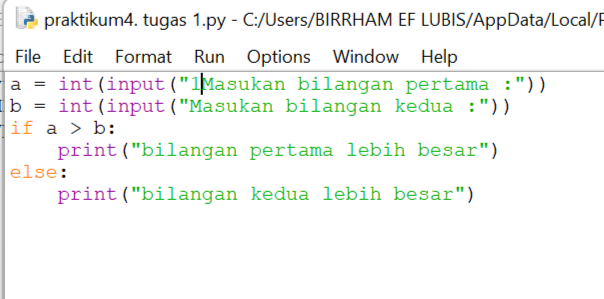
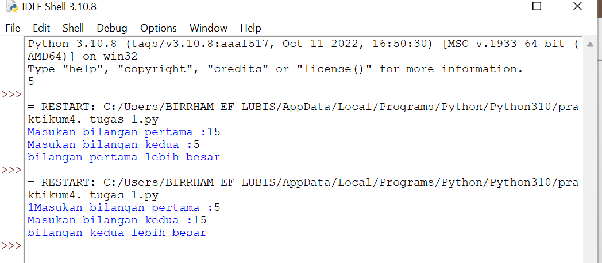
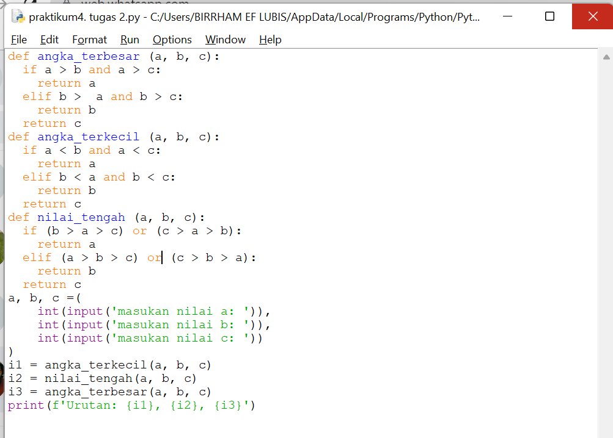
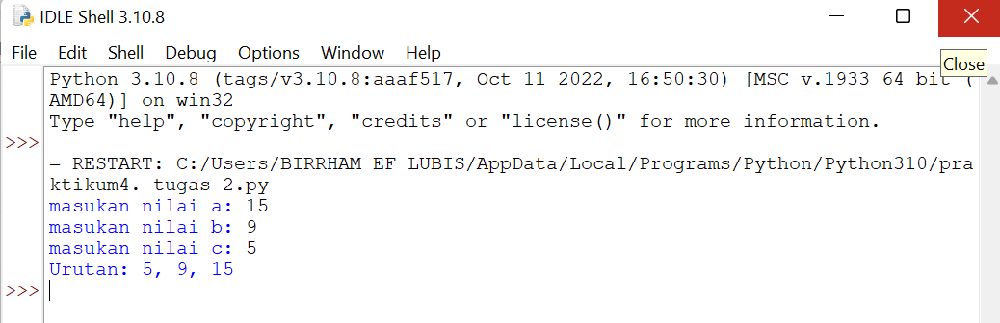
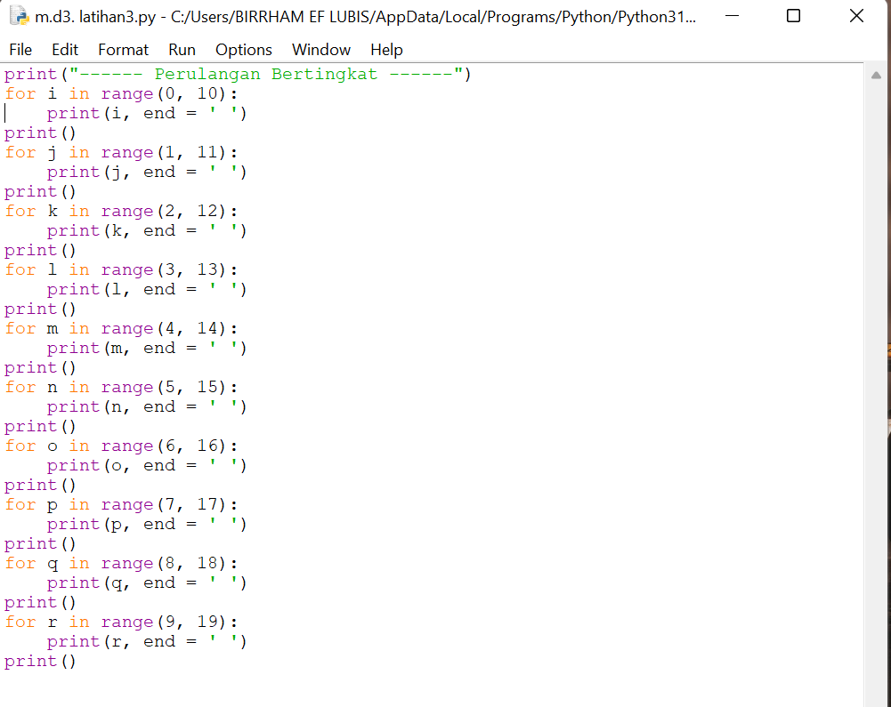
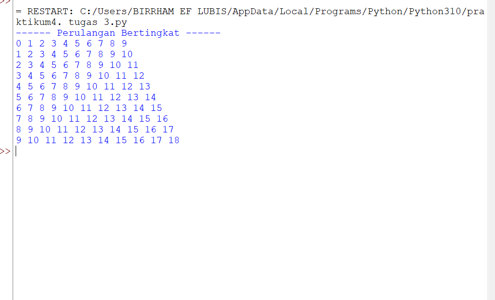
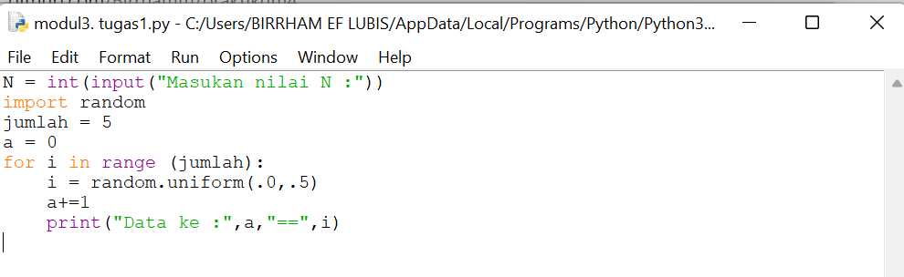
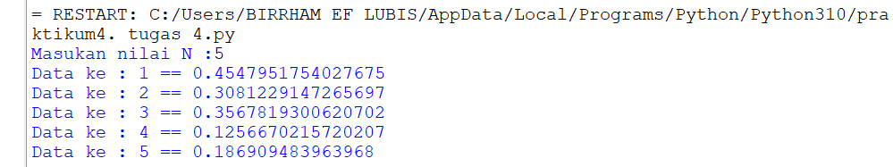

# Praktikum 4

## Lab 2 : Struktur Kondisi

### Latihan 1

#### Buat program sederhada dengan input 2 buah bilangan, kemudian tentukan bilangan terbesar dari kedua bilangan tersebut menggunakan statement if.
-pertama masukan inputan

-lalu tekan enter dan masukan if dna tambahkan a > b:

-setelah itu masukan perintah print("bilangan pertama lebih besar")

-lalu masukan else:

-dan masukan perintah print("bilangan kedua lebih besar") seperti gambar di bawah ini

 

-setelah itu kita running dan masukan angka yang kita ingingkan

### Latihan 2  

#### Program untuk mengurutkan data berdasarkan input sejumlah data (minimal 3 variable input atau lebih), kemudian tampilkan hasilnya secara berurutan mulai dari data terkecil.

## Lab 3 : Perulangan 

### Latihan 1

#### Buat program dengan perulangan bertingkat (nested) for yang menghasilkan output sebagai berikut:

-Kita mulai lagi dengan codingan seperti di bawah ini dengan for i range (1,10)

-Lakukan perintah ("ini di luar pernyataan if")

-Masukan for i range 1,10 supaya mendapat kan angka 1 sampai 10 lalu gabungkan i + j kemudin print untuk menghasilkan kan running gambar di bawah ini

### Latihan 2

#### -Tampilkan n bilangan acak yang lebih kecil dari 0.5.

-Kita mulai dengan codingan seperti gambar di bawah ini

-Setelah itu kita running maka akan ada perintah untuk memasukan nilai N maka saya isi dengan angka 5 dan hasil nya adalah seperti gambar di bawah ini

